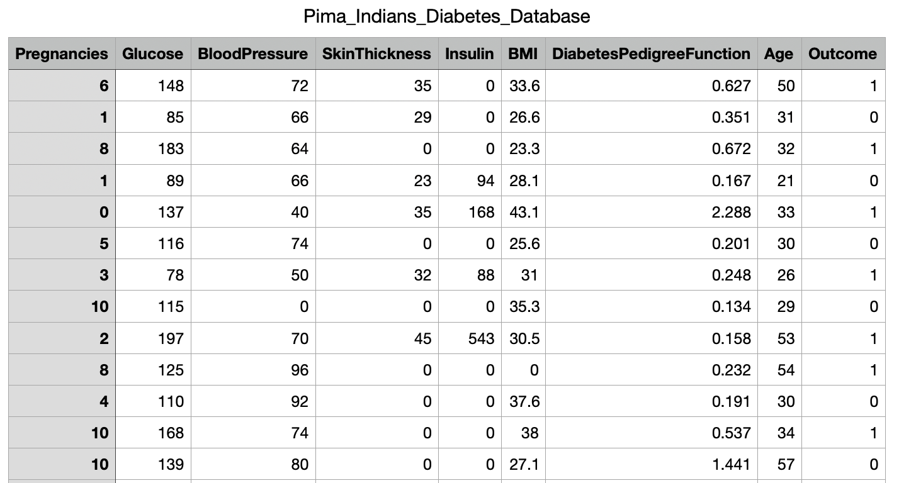

# Tabular_data_Generation_Using_CTGAN

# CTGAN Synthetic Data Generation

**Overview**

This repository contains a project demonstrating the use of CTGAN (Conditional Tabular GAN) for generating synthetic tabular data. CTGAN is a powerful tool for privacy-preserving data analysis and machine learning tasks. 

**Getting Started**

1. **Clone the Repository:**
   ```bash
   git clone [url]

2. **install CTGAN:**
   ```bash
   pip install ctgan


3. **Run the Script:** Execute the main script to train the CTGAN model and generate synthetic data:
   ```bash
   python data_gen.py

# Real Data (PIMA Indian Diabetes dataset)




